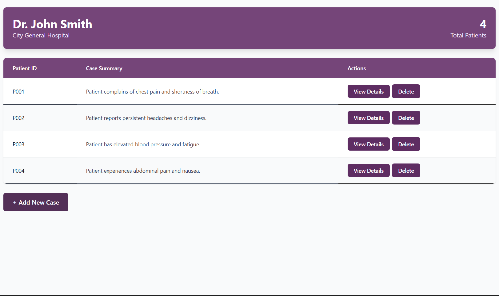
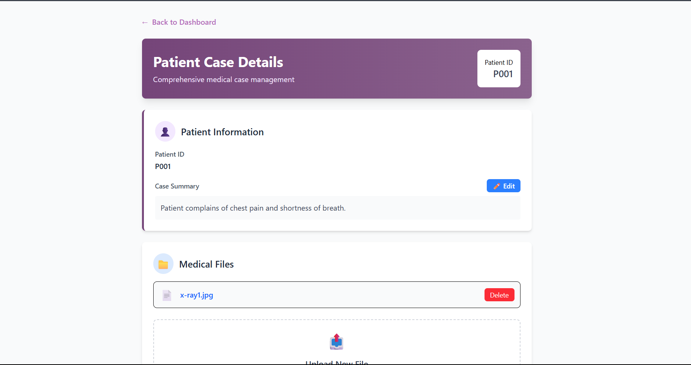
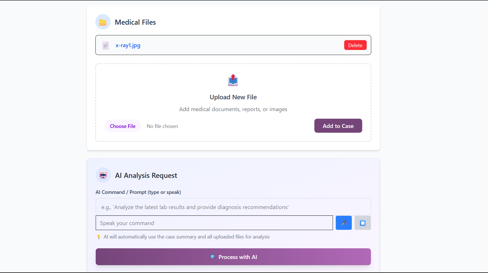
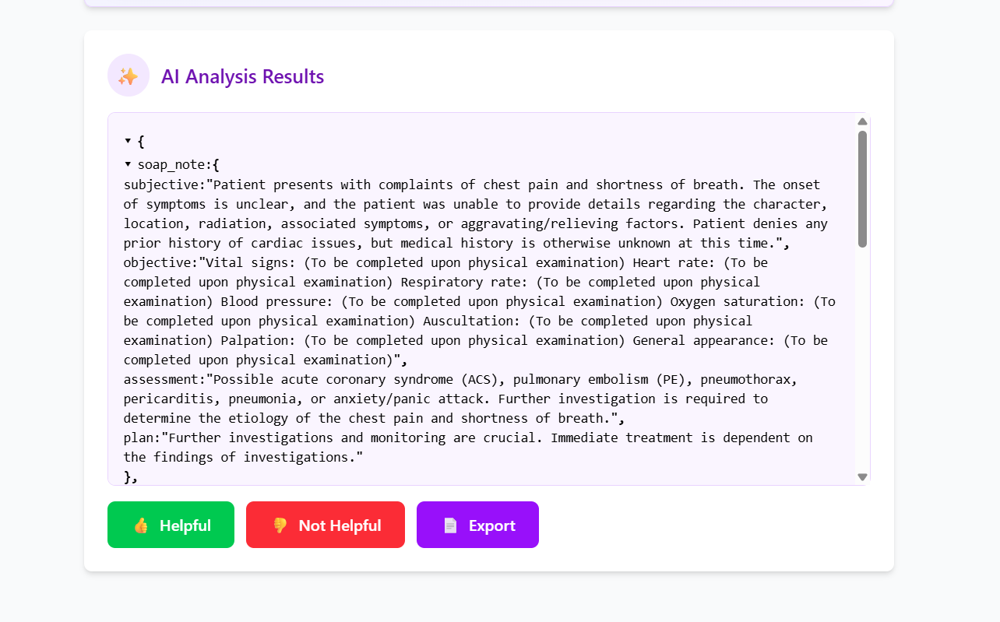

<div align="center">
  <h1>🏥 Treatly - Multimodal Clinical Insight Assistant</h1>
  
  <p>
    <strong>A lightweight MERN stack web application that empowers doctors with AI-driven clinical insights through multimodal data fusion</strong>
  </p>

  <!-- Badges -->
  
  
  
  
  
  
  <!-- [](https://treatly-uthh.onrender.com) -->
  <!-- [](https://treatly-backend.onrender.com) -->

</div>

- **Demo Video:** [Click](https://youtu.be/emnshwGmwjk?si=85nun53j5JAb3-ik) 
## 🎯 Overview

**Treatly** is a multimodal clinical insight assistant designed to revolutionize how doctors interact with patient data. By combining text summaries, lab reports (CSV/PDF), and medical images (JPG/PNG/DICOM), Treatly leverages Google Gemini AI to provide comprehensive clinical insights including SOAP notes, differential diagnoses, and treatment recommendations.

### Key Capabilities

- **📝 Case Summary Capture**: Type patient case summaries
- **📊 Lab Report Analysis**: Upload and process CSV/PDF lab reports
- **🖼️ Medical Image Processing**: Handle radiology images (JPG/PNG/DICOM)
- **🎤 Voice Commands**: Request information via spoken commands
- **🤖 AI-Powered Insights**: Generate structured SOAP notes and clinical recommendations
- **👩‍⚕️ Doctor Authentication**: Secure login system for healthcare professionals

## ✨ Features

### 🏥 Clinical Features
- **Multimodal Data Fusion**: Combines text, lab data, and images for comprehensive analysis
- **SOAP Note Generation**: Automated creation of Subjective, Objective, Assessment, Plan notes
- **Differential Diagnoses**: AI-suggested potential diagnoses
- **Treatment Recommendations**: Evidence-based treatment suggestions
- **Confidence Scoring**: AI confidence metrics for clinical decisions

### 🛠️ Technical Features
- **Speech-to-Text**: Native Web Speech API integration for voice commands
- **Real-time Processing**: Live transcript display during voice input
- **File Management**: Upload and delete patient files
- **Responsive Design**: Works seamlessly across desktop and mobile devices
- **Secure Authentication**: JWT-based user authentication
- **Component Architecture**: Modular React components for maintainability

### 🔒 Security & Compliance
- **User Isolation**: Each doctor sees only their own cases
- **Secure File Storage**: Protected file upload and storage system
- **Authentication Middleware**: Protected API endpoints


## 🚀 Tech Stack

### Frontend
- **React 19** - Latest React with modern hooks
- **Vite** - Fast build tool and development server
- **Tailwind CSS** - Utility-first CSS framework
- **Axios** - HTTP client for API requests
- **React Router** - Client-side routing
- **Web Speech API** - Native speech recognition

### Backend
- **Node.js** - JavaScript runtime
- **Express.js** - Web application framework
- **MongoDB** - NoSQL database
- **Mongoose** - MongoDB object modeling
- **JWT** - JSON Web Tokens for authentication
- **Multer** - File upload middleware
- **CORS** - Cross-origin resource sharing

### AI & Integration
- **Google Gemini API** - Large language model for clinical insights
- **File Processing Libraries**:
  - `csv-parser` - CSV file parsing
  - `pdf-parse` - PDF text extraction

<!-- ### Deployment
- **Render** - Cloud platform for both frontend and backend
- **MongoDB Atlas** - Cloud database hosting -->

## 🛠️ Installation

### Prerequisites
- Node.js (v18+)
- MongoDB (local or Atlas)
- Google Gemini API key

### 1. Clone the Repository
```bash
git clone https://github.com/KaranOps/Treatly.git
cd Treatly
```

### 2. Backend Setup
```bash
cd backend
npm install

# Create .env file
touch .env
```

Add the following environment variables to `.env`:
```env
MONGO_URI=your_mongodb_connection_string
JWT_SECRET=your_jwt_secret_key
GEMINI_API_KEY=your_google_gemini_api_key
PORT=3000
```

Start the backend server:
```bash
npm start
```

### 3. Frontend Setup
```bash
cd frontend
npm install

# Create .env file
touch .env
```

Add the following environment variable to `.env`:
```env
VITE_API_URL=http://localhost:3000
```

Start the frontend development server:
```bash
npm run dev
```


## 📚 API Reference

| Endpoint                                 | Method   | Description                                                        |
|------------------------------------------|----------|--------------------------------------------------------------------|
| `/api/user/register`                     | POST     | Register a new doctor account                                      |
| `/api/user/login`                        | POST     | Login and receive JWT token                                        |
| `/api/cases`                             | GET      | List all patient cases for the logged-in doctor                    |
| `/api/case/:caseId`                      | GET      | Get details of a specific patient case                             |
| `/api/case`                              | POST     | Create a new patient case (summary, patientId)                     |
| `/api/case/:caseId/summary`              | PUT      | Update the summary of a patient case                               |
| `/api/case/:caseId/files`                | POST     | Upload a file (lab report/image) to a patient case                 |
| `/api/case/:caseId/files/:fileId`        | DELETE   | Delete a specific file from a patient case                         |
| `/api/ai/process-case`                   | POST     | Send summary/files/command for AI analysis and get structured JSON |

All endpoints require authentication (Authorization: Bearer <token>) unless registering or logging in.
All endpoints accept and return JSON unless uploading files (which use multipart/form-data).

## 💡 Usage

### 1. **Doctor Registration & Login**
- Navigate to the registration page
- Create an account with email and password
- Log in to access the dashboard

### 2. **Creating a New Case**
- Click "Add New Case" from the dashboard
- Enter patient ID and case summary
- Optionally upload lab reports or medical images
- Submit to create the case

### 3. **AI Analysis**
- Open any existing case
- Use the AI Analysis form to:
  - Update case summary
  - Upload additional files
  - Enter voice or text commands
- Click "Process with AI" to get insights


### 5. **Viewing Results**
- AI results appear in a collapsible JSON format
- View SOAP notes, diagnoses, and recommendations
- Provide feedback with thumbs up/down buttons

## 📸 Screenshots

### Dashboard


### Case Details



### AI Results

*Structured display of AI-generated clinical insights*

## 📁 Project Structure

```
Treatly/
├── backend/
│   ├── controllers/
│   │   ├── userController.js
│   │   ├── patientController.js
│   │   └── aiController.js
│   ├── models/
│   │   ├── User.js
│   │   ├── Case.js
│   │   └── File.js
│   ├── routes/
│   │   ├── userRoutes.js
│   │   ├── patientRoutes.js
│   │   └── aiRoutes.js
│   ├── middleware/
│   │   └── auth.js
│   ├── config/
│   │   └── db.js
│   ├── uploads/
│   ├── .env
│   ├── package.json
│   └── server.js
├── frontend/
│   ├── src/
│   │   ├── components/
│   │   ├── pages/
│   │   │   ├── Login.jsx
│   │   │   ├── Register.jsx
│   │   │   ├── Dashboard.jsx
│   │   │   ├── CaseDetails.jsx
│   │   │   └── AddOrUpdateCase.jsx
│   │   ├── App.jsx
│   │   └── main.jsx
│   ├── public/
│   ├── .env
│   ├── package.json
│   └── vite.config.js
└── README.md
```


## 🙋 About Me

Hi! I’m **Karan** 👋 — a full-stack developer passionate about **AI**, **creativity tools**, and building solutions that solve real-world problems.

Let’s connect on [LinkedIn](https://www.linkedin.com/in/karanops93) or check out more of my work on [GitHub](https://github.com/KaranOps).


---

<div align="center">
  <p>
    <strong>🏥 Empowering Healthcare with AI-Driven Insights</strong>
  </p>
  <p>
    Made with ❤️ for the medical community
  </p>
</div>